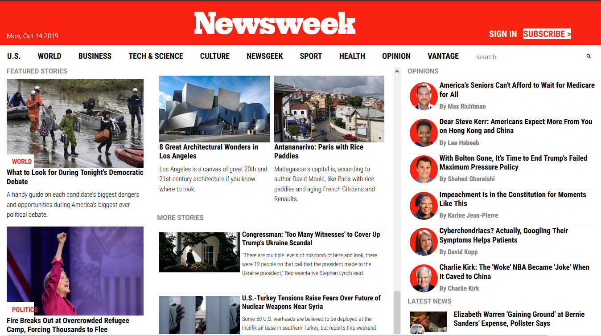
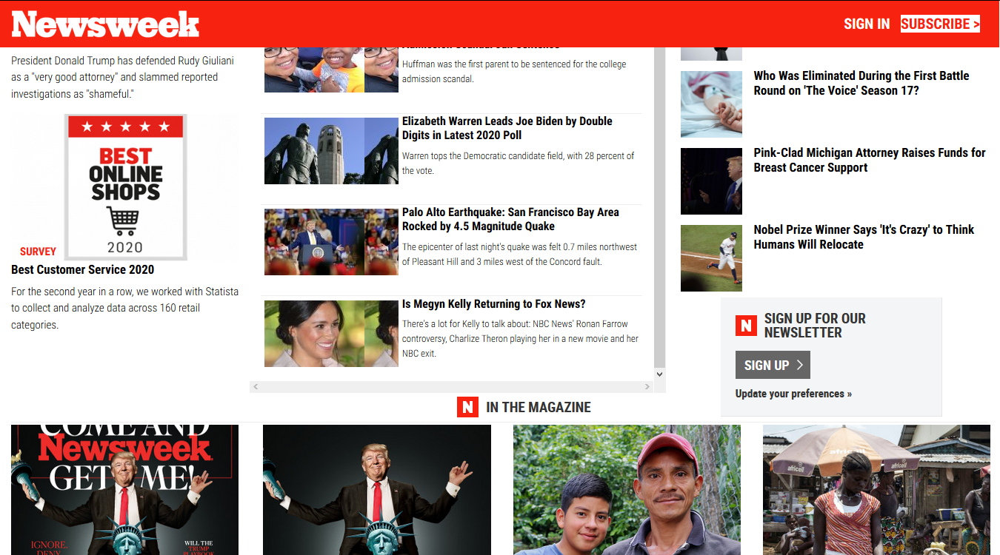
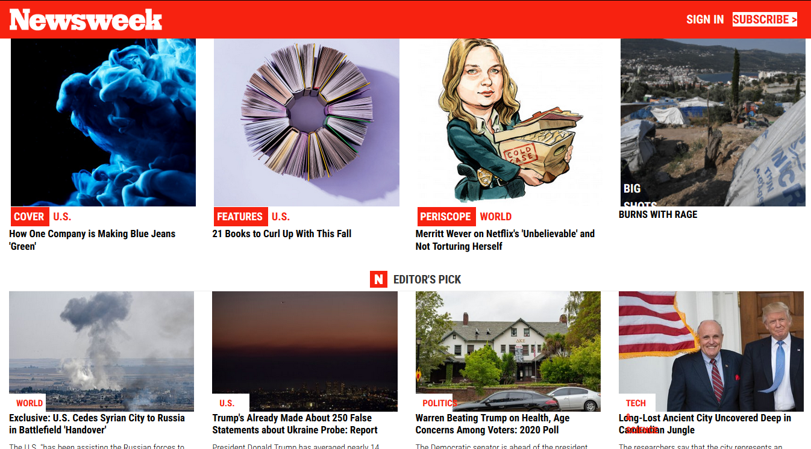
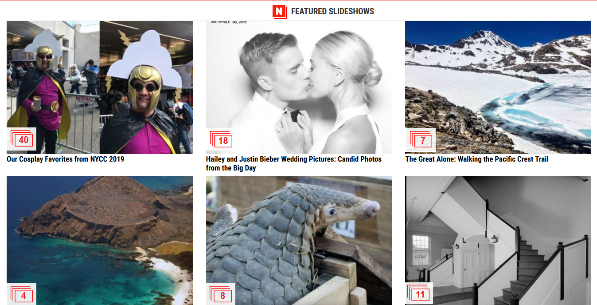
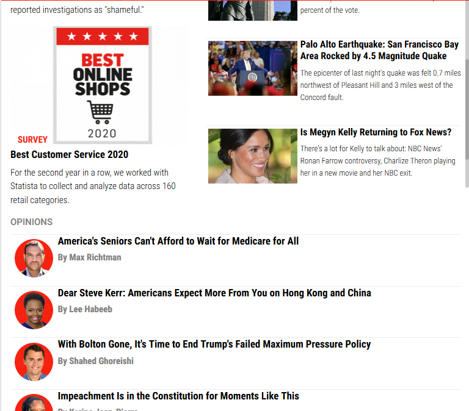
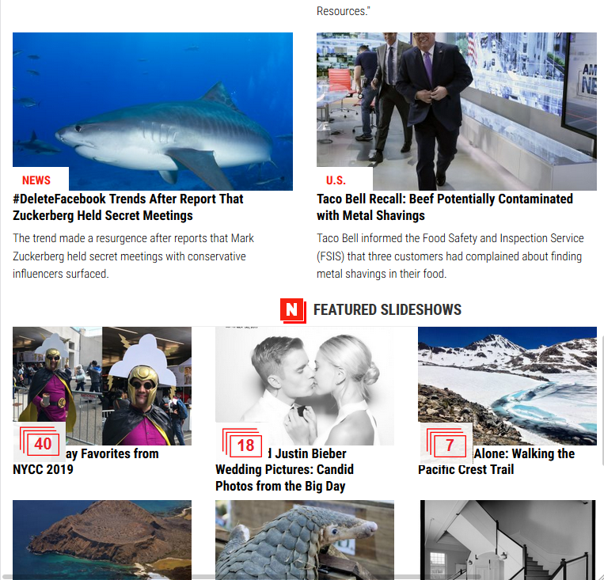
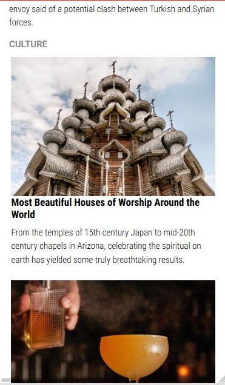
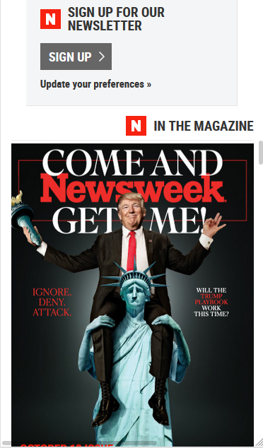
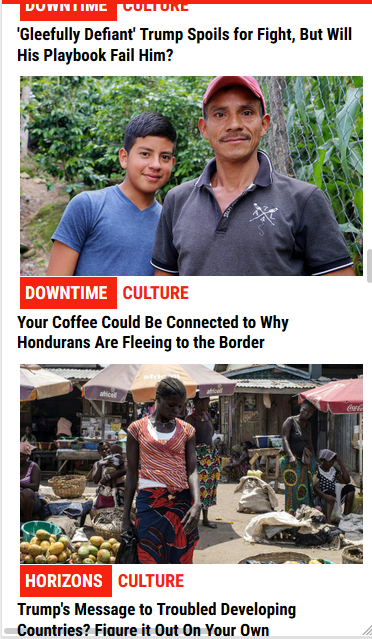
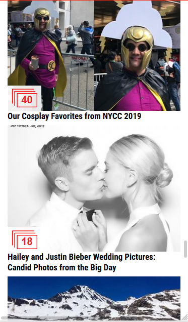

# DesignTeardown

## [ Solo Project ]

This project requests students to build a replica of the news site [ Newswekk.com ] (Newsweek.com) using the Bootstrap framework.

You can find the original project specification at: https://www.theodinproject.com/courses/html5-and-css3/lessons/using-bootstrap

# Project Screenshot

## large screens

## medium screens (tablets)

## small screens (mobile)

[ LIVE DEMO: ](https://usagib.github.io/bootstrap/)

#### Authors
* [ @usagib ](https://github.com/Usagib)
