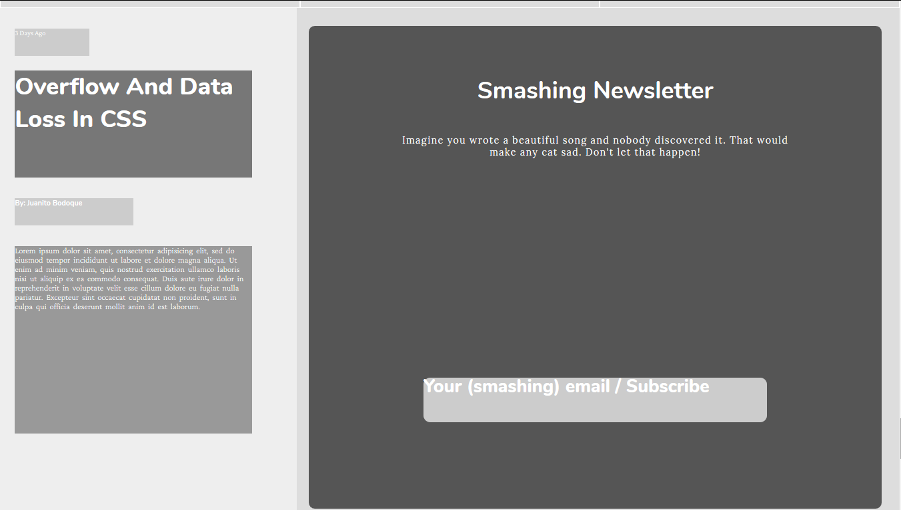

# DesignTeardown

## [ Collaborative project ]

This project consists of building a heatmap of the Smashing magazine website

You can find the original project specification at: https://www.theodinproject.com/courses/html5-and-css3/lessons/design-teardown

# Project Screenshot

 
 

 
 
 
 
 
 

### Also try to invert it! is on BETA 🔬⚗️
 
 
 
 

[ LIVE DEMO: ](https://usagib.github.io/heatmap
) 

#### Authors 
* [ @usagib ](https://github.com/Usagib)
* [ @sebastianlujan ](https://github.com/sebastianlujan)
