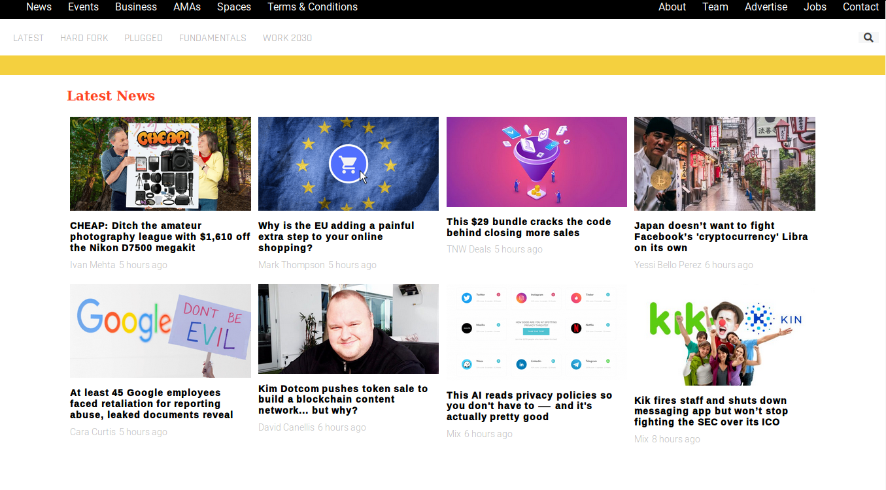
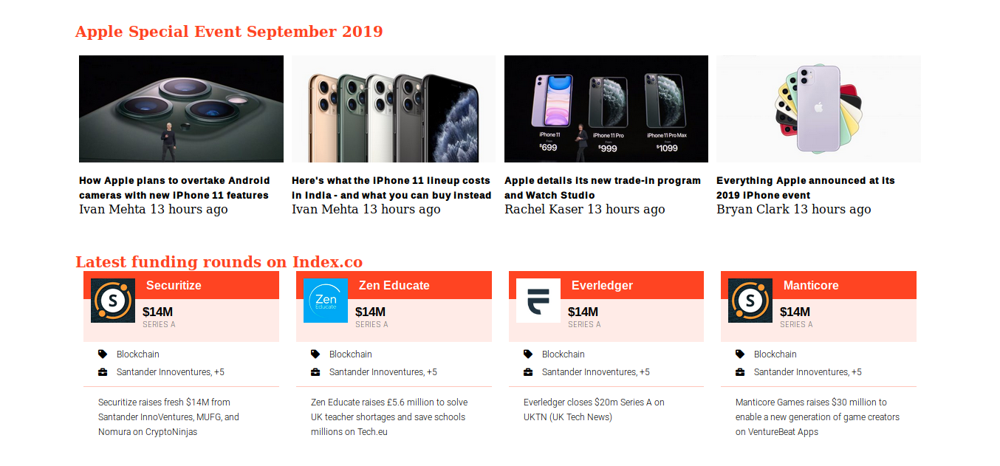
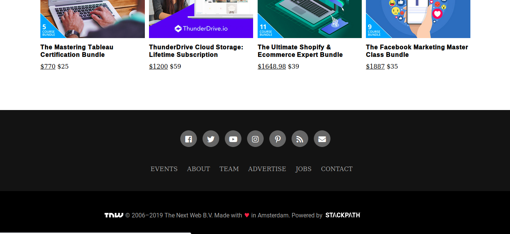
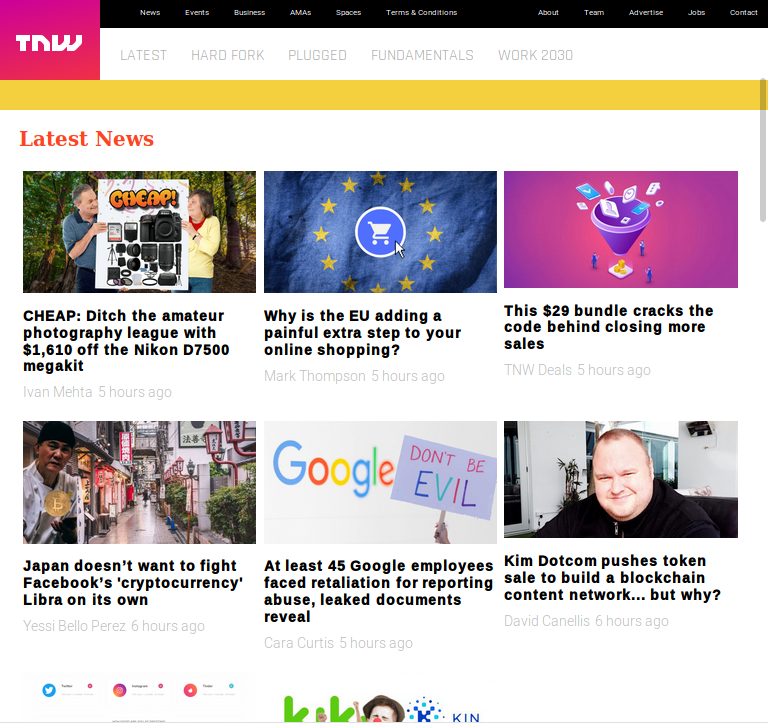
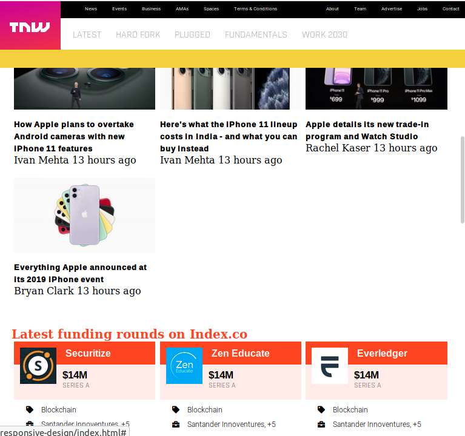
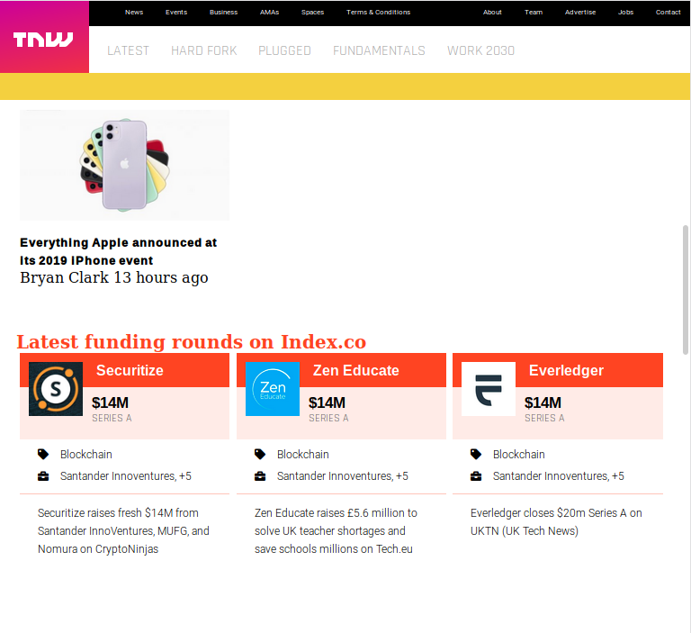
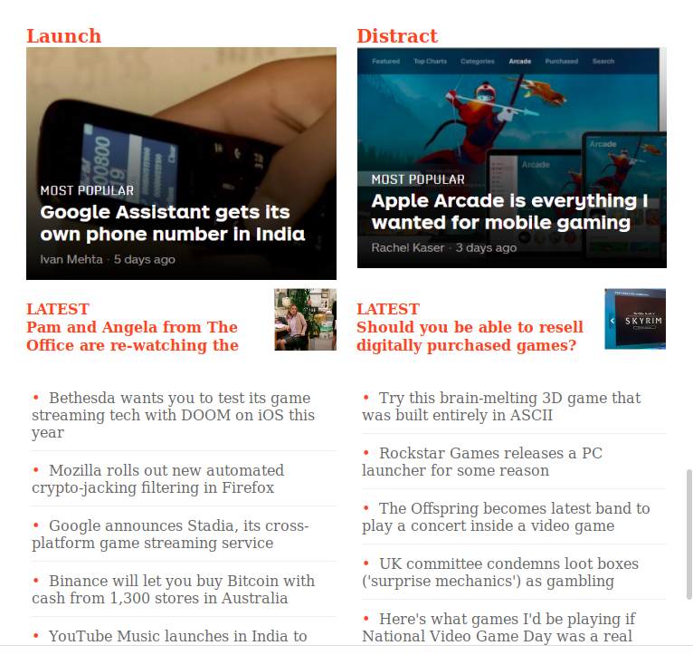
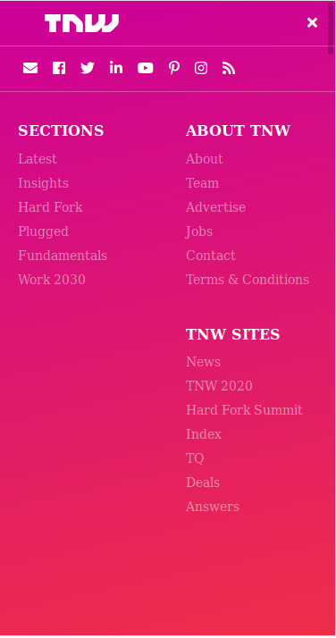
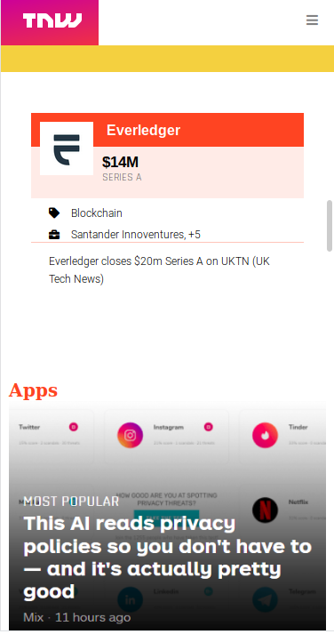
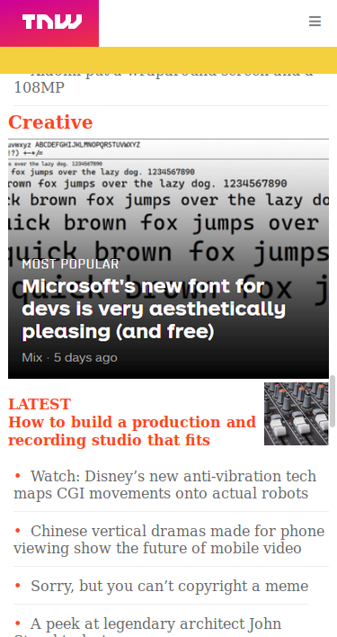

# Building-with-responsive-design

## [ Collaborative project ]

This project consists of replicating the The Next Web website putting emphasis on how it behaves differently depending on the size of the screen where the website is rendered.

You can find the original project specification at: https://www.theodinproject.com/courses/html5-and-css3/lessons/building-with-responsive-design

# Project Screenshot

### 1020 px breakpoint

---

---

---

---

---

---

### 740 px breakpoint

---

---

---

---

---

---

### 320 px breakpoint

[TRY THE LIVE DEMO!](https://usagib.github.io/tnw/)

#### Authors
* [ @usagib ](https://github.com/Usagib)
* [ @sebastianlujan ](https://github.com/sebastianlujan)
